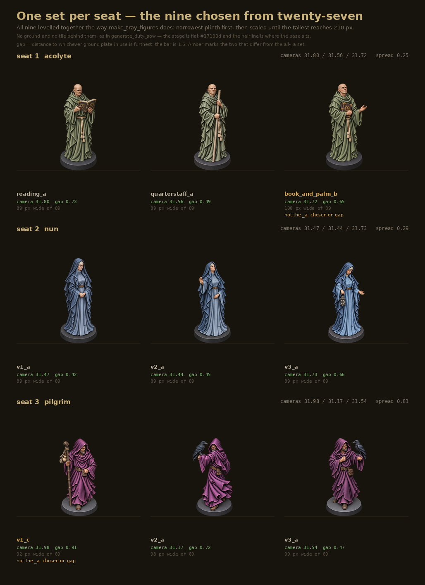

# Painted miniatures: how they were arrived at

A record that is still being added to. Started 2026-09-24, the day the seat 3 sculpts were
first painted; seats 2 and 1 followed the same afternoon. It exists because the useful thing
here is not the twenty-seven files on disk but the eighteen batches it took to get them, and
most of what those batches taught is invisible in the artwork.

All of this art is generated with ChatGPT and filed byte for byte, as everything under
`ui/assets-gothic/` is. Per-file provenance lives in `attribution.json`; this document is the
method.

## What a painted miniature is

A **finish**, not a sculpt. `ui/assets-gothic/sculpts/player_3_v1.png` is the geometry — grey
resin, 1.5% of its pixels saturated. `ui/assets-gothic/sculpts/painted/candidates/player_3_v1_a.png` is
the same figure painted. They are the same object at the same camera on the same base, and
the file names say so: a painted file is named after the sculpt it paints.

Finish and variant are separate axes and the folder keeps them separate. `v1`, `v2`, `v3` are
poses of seat 3. `painted/` is a finish of any of them. The suffix `_a`, `_b`, `_c` is which
painting, because more than one came back worth keeping.

## Where it stands

Twenty-seven files, all passing every check in `generate_asset_check.judge`. **Nine of them sit
in `sculpts/painted/` under a bare pose name and are the ones the board draws; the other
eighteen are in `sculpts/painted/candidates/` and keep their `_a`, `_b`, `_c` letter.** The
folder is the statement — what is in `painted/` is in use, the same way `sculpts/` already
works — so nothing downstream has to know which letter won.

**Seat 1 moved onto the v-convention on 2026-09-24.** It was filed under pose names where seats
2 and 3 used numbers, so `reading` became `player_1_v1`, `quarterstaff` became `player_1_v2` and
`book_and_palm` became `player_1_v3`, in the order they were generated. The description now
lives in the attribution title, exactly as `player_2_v3` is titled "veiled nun with a lantern".
The briefs moved with the art: `prompts/player_1_v3.md` is now `player_1_v1.md`, because it is
the one that produced the reading monk, and the seat's founding brief became
`prompts/player_1_c01.md` after the retired figure it made.

| file | camera | w/plinth | note |
|---|---|---|---|
| `painted/player_3_v3.png` | 31.54 | 1.121 | the one used as the colour reference since |
| `painted/candidates/player_3_v3_b.png` | 31.97 | 1.121 | best silhouette match to v3, 0.980 |
| `painted/candidates/player_3_v3_c.png` | 30.65 | 1.116 | |
| `painted/candidates/player_3_v1_a.png` | 32.33 | 1.032 | |
| `painted/candidates/player_3_v1_b.png` | 32.23 | 1.040 | gap 1.157 |
| `painted/player_3_v1.png` | 31.98 | 1.037 | gap 0.910, the smallest of the three — the row above said that of `_b` until 2026-09-24, wrongly |
| `painted/player_3_v2.png` | 31.17 | 1.111 | 0.72 from the furthest plate — the closest any painted figure has come |
| `painted/candidates/player_3_v2_b.png` | 32.13 | 1.104 | |
| `painted/candidates/player_3_v2_c.png` | 30.50 | 1.115 | |
| `painted/player_2_v1.png` | 31.47 | 1.000 | 0.40 from the furthest plate |
| `painted/candidates/player_2_v1_b.png` | 31.37 | 1.000 | |
| `painted/candidates/player_2_v1_c.png` | 30.50 | 1.000 | |
| `painted/player_2_v2.png` | 31.44 | 1.000 | |
| `painted/candidates/player_2_v2_b.png` | 31.78 | 1.000 | |
| `painted/candidates/player_2_v2_c.png` | 30.15 | 1.000 | marginal — the two estimators straddle the bar on this one |
| `painted/player_2_v3.png` | 31.73 | 1.006 | 0.66 from the furthest plate |
| `painted/candidates/player_2_v3_b.png` | 31.21 | 1.002 | |
| `painted/candidates/player_2_v3_c.png` | 31.82 | 1.003 | |
| `painted/player_1_v1.png` | 31.80 | 1.000 | |
| `painted/candidates/player_1_v1_b.png` | 32.14 | 1.000 | |
| `painted/candidates/player_1_v1_c.png` | 32.16 | 1.000 | eight of eight inside the bar, the only pose that managed it |
| `painted/player_1_v2.png` | 31.56 | 1.000 | 0.49 from the furthest plate — the closest painted figure on file |
| `painted/candidates/player_1_v2_b.png` | 31.32 | 1.000 | |
| `painted/candidates/player_1_v2_c.png` | 31.21 | 1.000 | |
| `painted/candidates/player_1_v3_a.png` | 31.26 | 1.122 | capacity box 320.0 of a 320 px frame — no margin left |
| `painted/player_1_v3.png` | 31.72 | 1.126 | 0.65 against `_a`'s 0.63; the order of the two is inside the noise |
| `painted/candidates/player_1_v3_c.png` | 30.58 | 1.124 | |

All three seats the board draws are complete: three poses each, three paintings kept per pose,
twenty-seven files, nine of them promoted. Seat 4 has no filed sculpts at all and is never drawn on a duty tile
(`FIGURE_SEATS` is `(1, 2, 3)`). None of the twenty-seven is recoloured on disk; see the colour
section.

The `w/plinth` column is worth reading rather than skimming. Every seat-1 figure except
`player_1_v3` is no wider than its own base, and `v3` is the only figure in the
folder where seat 1 rather than seat 3 sets the five-figure capacity box. That box lands at
319.6 to 320.0 against a 320 px frame, so it fits and nothing more. The limit those widths are
measured against is a function, `(320 - 2 x 110) / plinth`, not the constant 1.136 this document
quoted before 2026-09-24; at the filed set's 88.5 px plinth it is 1.130.

## The briefs that worked

### The v3 paint — 2026-09-24, batch of ten, three kept

Attach, in this order:

1. `ui/assets-gothic/sculpts/player_3_v3.png` — the sculpt to paint
2. `ui/assets-gothic/sculpts/player_3_v1.png` — another accepted sculpt of the same man, for the angle

```
Based on the first attached image, please provide ten versions with
fully transparent background. Don't change the figure, the pose, the
base or the angle.

The second image is the same man on the same base, seen from the same
height. It is there only to hold that angle — do not take his pose or
his staff from it.

The same sculpt, painted rather than moulded in one colour. His robe is
a deep purple leaning to magenta rather than to violet. Skin and beard
in natural tones, belt and satchel in worn leather, the buckle dull
brass, the raven black with a cold sheen.

Painted by hand to tabletop display standard: shadows glazed into the
folds, highlights brought up on the raised edges, no gloss.

He stands on a plain round miniature base, the same size and the same
angle as the one in the first image, its rim flat and dark. Nothing on
the base but his boots: no rocks, no tufts, no gravel, and nothing
hanging over the rim.

Ten separate images, not a contact sheet.
```

### The v1 paint — 2026-09-24, batch of ten, three kept

Attach, in this order:

1. `ui/assets-gothic/sculpts/player_3_v1.png` — the sculpt to paint
2. `ui/assets-gothic/sculpts/painted/player_3_v3.png` — an already-painted figure, for the colour and the angle

```
Based on the first attached image, please provide ten versions with
fully transparent background. Don't change the figure, the pose, the
base or the angle.

The second image is the same man, painted, on the same base and seen
from the same height. Take the colours and the angle from it — not his
pose, and not the raven.

The same sculpt, painted rather than moulded in one colour. His robe is
the same purple as the second image. Skin and beard in natural tones,
belt and satchel in worn leather, the buckle dull brass, the staff in
dark weathered wood, the gourd pale. The cloth bundle slung from the
staff beside the gourd is coarse undyed sackcloth, grey-brown — not
robe cloth, and never the robe's purple.

Painted by hand to tabletop display standard: shadows glazed into the
folds, highlights brought up on the raised edges, no gloss.

He stands on a plain round miniature base, the same size and the same
angle as the one in the first image, its rim flat and dark. Nothing on
the base but his boots: no rocks, no tufts, no gravel, and nothing
hanging over the rim.

Ten separate images, not a contact sheet.
```

For v2, the same text with the staff and bundle clauses replaced by "the raven black with a
cold sheen", and the second-image line shortened to "Take the colours and the angle from it,
not his pose" — v2 carries a raven of its own, so there is nothing to warn it off.

### The seat 2 paint — 2026-09-24, four images at a time, three kept per pose (all three poses)

Attach the sculpt and nothing else: `ui/assets-gothic/sculpts/player_2_v1.png`, or `_v2.png`.

```
Based on the attached image, please provide four versions with fully
transparent background. Don't change the figure, the pose, the base or
the angle.

The same sculpt, painted rather than moulded in one colour. Her veil
and mantle are a cold slate blue; the gown beneath them is the same
blue a shade lighter. The band across her forehead is undyed linen,
her face and hands in natural tones, the belt in worn leather with a
dull brass buckle.

Painted by hand to tabletop display standard: shadows glazed into the
folds, highlights brought up on the raised edges, no gloss.

She stands on a plain round miniature base, the same size and the same
angle as the one in the attached image, its rim flat and dark. Nothing
on the base but the hem of her gown: no rocks, no tufts, no gravel,
and nothing hanging over the rim.

Four separate images, not a contact sheet.
```

No boots clause — her gown reaches the base and no feet are visible. The gown stays in the seat
colour rather than going undyed, because seat separation is what this seat was painted to test
and she is mostly gown.

**No reference image, and this seat is where that was settled.** With nothing attached but the
sculpt, the robe landed at hue 214 to 219 against the pawn's 213 — the closest of any batch that
day — after three consecutive seat-3 batches with a painted reference attached had failed to
reach their target at all.

For **v3**, which carries a lantern, the materials line gains one clause and nothing else
changes:

```
...the belt in worn leather with a
dull brass buckle, and the lantern in dark iron with pale glass panes.
It is unlit: no glow, and no warm light spilling onto the cloth.
```

That clause earns its place twice. A lit lantern would put semi-transparent glowing pixels
outside the silhouette, which is the halo the rim check exists to catch. And warm light spilling
onto the gown would tint those pixels out of the blue hue window the recolour masks on, leaving
a warm patch that nothing corrects. Twelve images across three batches all came back with the
lantern dark; measured, their semi-transparent edge pixels sit at 54 to 62 luminance against
bodies of 89 to 96, so they are darker than the figure rather than lighter.

### The seat 1 paint — 2026-09-24, four images at a time, three kept per pose (all three poses)

Attach the sculpt and nothing else: `ui/assets-gothic/sculpts/player_1_v1.png`,
`player_1_v3.png`, or `player_1_v2.png`.

```
Based on the attached image, please provide four versions with fully
transparent background. Don't change the figure, the pose, the base or
the angle.

The same sculpt, painted rather than moulded in one colour. His habit
and the mantle over his shoulders are a muted sage green; the rope
cincture and its tassels are undyed hemp. His head, face and hands in
natural tones, the book bound in dark leather with brass corners and
pale pages.

Painted by hand to tabletop display standard: shadows glazed into the
folds, highlights brought up on the raised edges, no gloss.

He stands on a plain round miniature base, the same size and the same
angle as the one in the attached image, its rim flat and dark. Nothing
on the base but the hem of his habit: no rocks, no tufts, no gravel,
and nothing hanging over the rim.

Four separate images, not a contact sheet.
```

The text above is what **v1** (reading from an open book) and **v3** (the book at the chest
with one palm open) were painted with, unchanged. For **v2**, the quarterstaff, which holds no
book, the book clause becomes "the staff in pale weathered
wood" and nothing else moves.

No boots clause, as for seat 2 — the habit reaches the base. The rope cincture is named because
it is the one thing on the figure that is not cloth, not skin and not leather, and an unnamed
rope came back as another fold of habit in early seat-3 work.

**This brief produced the best cameras of the exercise and the worst single session of the
afternoon, and the difference was not in the text.** `v1` went eight of eight across two
sessions at means of 32.41 and 32.13, with standard deviations of 0.17 and 0.26 against a
previous best of 0.33 in thirteen batches. `v2` went seven of eight. `v3`
then split: four of four at 31.00 in one session and none of three at 28.41 in the next, four
minutes later, on identical text and the same attachment. Nineteen of twenty-three images
landed, and every miss is in that one session.

**The colour missed by about fifty degrees on all three poses and it did not matter.** "A muted
sage green" came back khaki — hue 65 to 72 against the seat-1 pawn's sage at 115 — apparently
read as *muted* rather than as *green*. The brief was deliberately not changed: it was producing
eight of eight on the scarce property, which is the camera, and colour is set downstream by the
recolour on a 45-100 hue window. The habit and the bald head at about 24 to 29 are two clean
populations with an empty valley between them, so the mask has nothing to get wrong.

## Why the brief says what it says

Every line in it was bought with a batch. None of it is decoration.

**"fully transparent background"** — the first colouring pass came back as RGB on black with
zero transparent pixels, and had to be cut out by flood-filling the border. A cutout from
black leaves a dark edge wherever the rim was soft. Naming it fixed it and it has never
recurred.

**"Don't change the figure, the pose, the base or the angle"** — the line that has held all
along. It is obeyed on figure and pose and ignored on angle, which is the next section.

**"a plain round miniature base … nothing hanging over the rim"** — the rim clause is the one
line to never cut. Anything spilling over the base's front edge lands in the bottom outline
that `ground_ellipse` fits, and one figure measured that way reported 39.57 degrees, which is
not a camera at all. Scenic basing is wrong here for a second reason: `duty_grounds.json` says
a ground is a transparent layer drawn under the figures, so a gravelled base standing on a
gravelled plate gives two grounds arguing with each other.

**The cloth bundle clause** — the first v1 paint put the bundle slung from the staff in the
robe's purple, measured 2.94 dE from the robe and carrying the robe's own diamond weave. It
had simply never been named, so it defaulted to more cloth on this figure. Grey-brown rather
than pale, because the gourd beside it is already cream and two pale objects touching merge at
210 px.

**"a deep purple", and nothing more directional** — two attempts to steer the hue with words
missed by 19 degrees one way and 14 the other. "Bishop's purple" was lifted from the `CLOTH`
table in `ui/render/recolor_seat_layers.py`, which is the frame drape's plum at hue 298, not
the sculpt's at 312. There are two plums in this project. Since the colour is now set after
the fact (below), the wording matters less than it did.

## What is measured, and the bars

Everything divides by the figure's own plinth width, so a render that came back larger or
smaller compares directly.

| | bar | why |
|---|---|---|
| camera | within 1.5 degrees of the furthest ground plate in use | `duty_grounds.json`'s angle note: ground and figure within about a degree and a half is inside the generator's own scatter. The plates in use span 31.07 to 31.89. |
| width | `w/plinth` at most `100 ÷ the tray's plinth at 210` | 2 × spread + widest must fit the 320 px frame; the limit moves with the art, see below |
| pose | overlap higher against the sculpt being painted than against any other | the reason to paint v1 and v2 separately is their different poses |
| colour | CIE76 dE against the family | the four seat colours sit 28 apart; under about 2 is invisible |
| rim | `sm.fringe` negative, nowhere near +6 | a part-transparent rim lighter than the body is a halo |

The plate window of 31.065 to 32.025 is **not** the bar for a figure. It is asserted by
`test_the_plate_window_is_locked_and_every_plate_is_inside_it` and it applies to plates.

**The width limit is a function, not a constant, and this note exists because it was quoted as
one.** `2 × spread + widest ≤ FRAME.w` leaves the widest figure 100 px, so the limit on
`w/plinth` is 100 divided by the tray's plinth at 210 — and that plinth moves whenever the art
does, because `make_tray_figures.py` levels the set on the narrowest plinth and then scales
until the tallest hits 210. Today it is 90.6 px, giving 1.104. With the filed sculpts for seats
1–3 in, `player_1_v1` is taller, the shared plinth falls to 88.5, and the limit rises to
1.130. The 1.136 quoted throughout 2026-09-24, including into `attribution.json`, came from an
88 px plinth — which is what levelling the whole `sculpts/` folder gives, not what the tray
gives. So the number was never wrong so much as detached from the set it described, which is
the failure mode a remembered constant has.

**Only seats 1–3 count toward it.** `FIGURE_SEATS` in `generate_duty_board_check.py` is `(1, 2,
3)` and `generate_duty_sow.py` says the same in a comment, so player_4 is in the tray but never
on a duty tile. An earlier version of this section included it and reported the frame as already
overflowing by 8.3 px; that was wrong. Player_4 is also inert in the levelling — player_1 has
both the narrowest plinth and the tallest levelled figure, so it fixes the target and the scale
on its own.

**The consequence is that a partial migration breaks the tile, not the art.**

| tray composition | plinth | widest (1–3) | CAP.w | |
|---|---|---|---|---|
| today, concept art ×4 | 90.6 | 90.9 | 310.9 | fits 320 |
| player_3 → v3 alone | 90.6 | 101.3 | 321.3 | over by 1.3 |
| player_3 → painted v3_a alone | 90.6 | 101.6 | 321.6 | over by 1.6 |
| player_3 → v2 alone | 90.6 | 100.4 | 320.4 | over by 0.4 |
| player_3 → v1 alone | 90.6 | 94.3 | 314.3 | fits |
| the filed set for seats 1–3 | 88.5 | 98.9 | 318.9 | fits |
| the filed set, player_3 painted | 88.5 | 99.2 | 319.2 | fits |

v3 is not too wide; it is too wide standing next to the old player_1. Migrate the three seats
together.

**Do not widen the frame to buy margin.** It is tempting — 318.9 of 320 is a 1.1 px margin, and
nothing is drawn to the frame yet, since `.frame` is a CSS border in both pages. But a ground
plate is sized as a percentage of the frame's width (`gw = FRAME.w * gs.scale / 100`), so ten
pixels of frame widens all six plates by 3%, and `lift` and the banner clearance were tuned
against their present size. That is re-tuning the grounds to fix a pixel of figure.

What to do instead is make the limit visible rather than remembered: `generate_asset_check`'s
arrangement card now prints the live figure alongside the measured span, derived from the art it
just drew.

## The session lottery

Eighteen batches in under four hours, and the camera is the thing that moves.

| time | sculpt | attachments | camera mean | sd | inside the 1.5 bar |
|---|---|---|---|---|---|
| 12:37 | v3 | the sculpt | 28.31 | 0.93 | 0 of 10 |
| 12:50 | v3 | sculpt + another sculpt | 30.05 | 1.27 | 3 of 10 |
| 13:37 | v1 | the sculpt | 30.35 | 1.78 | 6 of 10 |
| 14:00 | v1 | sculpt + a painted figure | 32.54 | 0.33 | 6 of 10 |
| 14:11 | v2 | sculpt + a painted figure | 26.88 | 1.39 | 0 of 10 |
| 14:41 | v2 | sculpt + a painted figure, four images | 30.58 | 1.53 | 3 of 4 |
| 14:55 | seat 2 v1 | the sculpt alone, four images | 30.92 | 0.59 | 3 of 4 |
| 15:06 | seat 2 v2 | the sculpt alone, four images | 20.14 | 3.44 | 0 of 4 |
| 15:12 | seat 2 v2 | identical text, fresh chat | 31.02 | 0.87 | 3 of 4 |
| 15:23 | seat 2 v3 | the sculpt alone, four images | 28.94 | 1.75 | 1 of 4 |
| 15:29 | seat 2 v3 | unchanged | 30.95 | 1.30 | 3 of 4 |
| 15:33 | seat 2 v3 | unchanged | 29.64 | 1.25 | 1 of 4 |
| 15:47 | seat 1 v1 | the sculpt alone, four images | 32.41 | 0.17 | 4 of 4 |
| 15:49 | seat 1 v1 | unchanged | 32.13 | 0.26 | 4 of 4 |
| 16:02 | seat 1 v2 | the sculpt alone, four images | 31.55 | 0.48 | 4 of 4 |
| 16:05 | seat 1 v2 | unchanged | 30.78 | 0.96 | 3 of 4 |
| 16:12 | seat 1 v3 | the sculpt alone, four images | 31.00 | 0.47 | 4 of 4 |
| 16:16 | seat 1 v3 | unchanged | 28.41 | 1.57 | 0 of 3 |

The 15:06 batch is the clearest case in the set: the same text that produced 30.92 twenty
minutes earlier returned 20.14, nine and a half degrees below the sculpt's own 31.51, with all
four figures running off the bottom of the canvas because a flatter camera makes the figure
taller in frame. The clipping was checked rather than assumed — refitting the base ellipse with
the clipped columns thrown out moved three of the four readings by less than half a degree, so
it was a symptom and not the cause. A fresh chat on identical text returned 31.02.

**Seat 1 repeated the pattern in miniature and settles that the sculpt is not the explanation
either.** Its six sessions ran 32.41, 32.13, 31.55, 30.78, 31.00 and 28.41 — a mean of 31.05
with a spread of 1.44, better than any other seat, and still containing one session that missed
everything. Consecutive sessions four minutes apart on the same sculpt and identical text gave
31.00 and 28.41. Across all eighteen batches the session means have a standard deviation of
2.84, or 1.54 once the 20.14 outlier is set aside, against a within-batch spread near 1.1.
Between sessions still moves roughly as much as within one.

**No attachment configuration predicts the camera.** One image gave 0 and then 6; two images
gave 3, then 6, then 0. The 14:11 batch used exactly the attachments that produced the best
batch of the day eleven minutes earlier, on the easiest sculpt of the three, and fell five
degrees short. This is the same finding `duty_grounds.json` records for the ground plates —
the generator appears to pick a camera per session and hold it, and cobbles_oval took three
batches. Expect to run more than one.

**Smaller batches, more of them.** Across the six, the spread between session means is a
standard deviation of 1.96 while the mean spread within a batch is about 1.2. Ten images from
one chat are ten samples around a mean nobody chose; four images from each of three chats are
three draws at the mean itself, and a whole batch stands or falls on where its session landed.
That is why the successful v2 attempt asked for four.

**But the batch size is not what fixed it, and the arithmetic says so.** Fitting a normal to
each batch and asking what fraction should land inside the 1.5 bar gives 3% for the failed
ten-image run at 26.88 and 71% for the four-image run at 30.58, against 0 of 10 and 3 of 4
observed. The session mean explains the whole difference. 30.58 is four tenths of a standard
deviation above the six-batch average — an ordinary draw — and 26.88 was one and a half below
it, so the unusual batch was the failure, not the success. Asking for four rather than ten is a
hypothesis confounded with the session in every batch run so far, and it stays a hypothesis
until a session is sampled twice at different sizes.

A single-image probe was tried as a way to screen the camera before committing, and it does not
work for that: the 13:50 single render came in at 29.87 and the ten that followed in the same
chat averaged 32.5. Colour carried across the turn; the camera did not.

## What a painted reference image does, and does not do

It was argued both ways and both halves are now measured.

**It does not drag the pose.** This was the objection to attaching one, and it is wrong. With
an unreferenced batch as the control, overlap against the sculpt being painted ran 0.892 to
0.980 without a reference and 0.952 to 0.988 with one, against roughly 0.77 to the other
sculpt. Every image in both referenced batches was closer to its own sculpt than to the
reference's. Confirmed twice, on two sculpts, including in a batch that failed everything else.

**It does not fix the camera.** There is no evidence either way and the batch table above is
the reason to stop claiming otherwise.

**It helps the colour, but only in a session that was going to cooperate.** This is a claim
that was overstated once already and is recorded here in its narrow form:

| | best colour dE |
|---|---|
| no reference, ordinary session | 5.94 |
| reference, good session | 2.94 |
| reference, bad session | 5.50 |
| reference, third batch (v2, good session) | 6.70 |

Selection within a batch cannot repair a batch-level offset. The 12:37 batch sat at hue 286 to
299 against a target neighbourhood of 324 to 335; its closest image was 6.19 away and no
amount of picking would have helped.

## Colour is set afterwards, not generated

The finding that removes colour from the list of things a batch has to win. Hue is **set**,
saturation and value are **scaled** — exactly what `ui/render/recolor_seat_layers.py` does to
the frame drapes, and its docstring explains why the folds survive: V is only ever multiplied,
so every crease keeps its relative strength.

**Both of saturation and value, and that is not a detail.** Run with hue and saturation only,
seat 2's two painted poses agreed to between 2.67 and 5.49 dE; adding the value scaling took
them to 1.45, 1.48 and 1.76, which is invisible. Any figure in this document quoting a
cross-seat separation of 23.7 or 27.1 was measured with the incomplete version and understates
it. The mask is a hue window rather than a saturation
threshold, so skin, leather, wood and the raven are untouched.

Applied to the camera-passing images of the 14:00 batch, dE against the reference went 5.98 to
0.19, 5.92 to 0.43, 4.10 to 0.49, 6.33 to 0.28, 3.75 to 0.32, 4.26 to 0.42, 6.66 to 0.41. The
bar was 3.3; everything lands under 0.5, far below where a difference is visible at all. The
three filed v2s go 7.70, 6.70 and 9.52 to 0.54, 0.30 and 0.22.

**Nothing is recoloured on disk.** All nine painted files are committed exactly as generated.
The recolour is a build step and belongs in a script that writes derived files, the way
`recolor_seat_layers.py` writes sixteen from `cloth_red.png` — baking it into a committed
original would also quietly settle the hue 327 question below rather than leaving it open.

So a batch now only has to win the camera and the pose. On the 14:00 batch that is the
difference between two usable images and seven.

Two consequences. A recoloured file's `modifications` field in `attribution.json` stops being
"none; used as generated" and records the hue set — which is what that field is for. And the
target hue becomes a decision rather than an accident, which is the open question below.

Note on the measurement itself: colour figures quoted before this section was written used a
saturation-only mask that quietly included skin and leather. The hue-windowed mask is the
better one, and it moves individual numbers by around a point — `player_3_v1_a` reads 3.75
rather than 2.94. Nothing in the conclusions turns on it.

## Choosing one of the three

Three paintings were kept per pose because the camera is a session draw and more than one
usually survives it. Which of the three to actually use is a separate decision, and it was made
on 2026-09-24 by measuring all twenty-seven and scoring every combination: twenty-seven per
seat, 19,683 across the board.



**The set.**

| seat | | | |
|---|---|---|---|
| 1 acolyte | `player_1_v1` | `player_1_v2` | `player_1_v3` |
| 2 nun | `player_2_v1` | `player_2_v2` | `player_2_v3` |
| 3 pilgrim | `player_3_v1` | `player_3_v2` | `player_3_v3` |

Worst gap 0.910, cameras spanning 0.810 of a degree across all nine. Taking the `_a` file
everywhere instead gives 1.264 and 1.164.

**Two of the nine are not the `_a` file, and one reason is a filing mistake.** `player_3_v1`
has a gap of 0.910 against `_a`'s 1.264 and `_b`'s 1.157 — seat 3's v1 is the only pose where
the suffixes do not run in gap order, because `_a` there was picked before the gap was the
criterion. **The `_a` suffix means "the one I would have picked on the day", not "the smallest
gap", and for `player_3_v1` those differ.** Read the numbers, not the letter. The other
substitution is `player_1_v3`: 0.651 against `_a`'s 0.627 is a coin flip on gap,
but it pulls seat 1's three cameras into a 0.25 degree spread where `_a` gives 0.54.

**What actually discriminates, and what does not.**

*The camera does.* v1 of seat 3 is the binding constraint for the whole board: its best
painting sits at 0.910 and nothing else in the set is worse than 0.733, so the board's worst
gap is a fact about one pose. Improving it means generating v1 again, not choosing differently.

*Width does not, and this corrects an earlier reading in this document.* Across all 19,683
combinations the widest figure lands between 99.63 and 99.96 px against a 100 px limit. Every
combination fits; none fits with meaningfully more room. An earlier figure of 320.0 against
319.6 came from levelling three figures, one per seat. Levelled as nine, which is what
`make_tray_figures` does, the choice moves the number by about a third of a pixel. The margin
is thin everywhere and no pick buys it back.

*Colour does not either, which is the recolour working.* After recolouring each seat to its
plastic pawn, the worst within-seat disagreement in the chosen sets is 1.87 dE for seat 1, 1.48
for seat 2 and 0.42 for seat 3, against a bar of about 2 and a seat separation of 28. Seat 1
could be squeezed to 0.97 by taking `candidates/player_1_v2_b`, at the cost of doubling its camera
spread. Camera is the scarce property; colour is set downstream.

*Silhouette distinctness does not, because it is a property of the sculpt.* Best pairwise
overlap obtainable is 0.912 for seat 1, 0.922 for seat 2 and 0.792 for seat 3 — and buying the
seat-2 figure costs a gap of 1.738. Seat 3's three are three pilgrims at 0.799. Seat 1's three
overlap at 0.915 and seat 2's at 0.933, so both read as one figure repeated, and no choice
among the paintings fixes that. It is sculpt work; see the open questions.

**The runners-up, in case a pose is regenerated and the table has to be redone.** Combinations
are written as one letter per pose in the order the seat's poses are listed above.

| seat | combination | worst gap | camera spread | colour dE | worst overlap |
|---|---|---|---|---|---|
| 1 | **aab** | 0.733 | 0.246 | 1.87 | 0.915 |
| 1 | abb | 0.733 | 0.480 | 1.38 | 0.915 |
| 1 | aba | 0.733 | 0.540 | 0.97 | 0.915 |
| 1 | aaa | 0.733 | 0.540 | 1.46 | 0.915 |
| 2 | **aaa** | 0.663 | 0.292 | 1.48 | 0.933 |
| 2 | baa | 0.663 | 0.365 | 0.71 | 0.956 |
| 2 | bab | 0.675 | 0.226 | 1.40 | 0.956 |
| 2 | aab | 0.675 | 0.257 | 2.21 | 0.933 |
| 3 | **caa** | 0.910 | 0.810 | 0.42 | 0.799 |
| 3 | cab | 0.910 | 0.810 | 0.78 | 0.799 |
| 3 | cbb | 1.056 | 0.154 | 1.00 | 0.804 |
| 3 | cba | 1.056 | 0.589 | 0.29 | 0.804 |

Seat 1 is forced at the reading pose's `_a`: its other two paintings sit at 1.073 and 1.094 where that one is at
0.733, so any combination reaching 0.733 starts with it. Seat 2 has no forced pick and four
combinations within 0.02 of each other.

**Nothing reads this set yet.** It is recorded here and in the picture beside it, not in a
manifest. Wiring it into `make_tray_figures.py` and the placement sheet is the pipeline work
listed under the open questions.

## Open questions

**Hue 327 or hue 312.** The painted family agrees with itself to within 3.5 dE and sits 15 to
17 from the plastic plum pawn at hue 312. That is harmless while painted art *replaces* the
plastic in the tray, since nothing would show both. If the seat should actually sit on 312,
the recolour above is where it gets fixed, for the whole set at once, and it costs nothing.

**Seat separation under paint — ANSWERED 2026-09-24, and the answer is that it survives.**
Compare cloth to cloth, which is the signal that carries the seat, and painted blue sits 30.4 dE
from painted plum, against 31.0 for the plastic pawns and the 28 the palette was designed
around. Comparing the whole figure instead gives 19.7 and reads as a collapse — but that
averages in skin, leather, the buckle and the base, all of which are identical between seats and
none of which anyone uses to tell seats apart. The whole-figure measure was the wrong one and is
recorded here so it is not re-derived.

Pewter against plum was the pair to check because it is the tightest in the palette. Bone is
still untested and is the one to watch: it is only 19% saturated and carries its seat by pallor
rather than by hue, so it has less to lose and less to work with. Seat 4 is also the seat the
board never draws.

**Seat 2's three sculpts are not three acolytes.** They overlap each other at a mean 0.935 —
v1 against v2 is 0.955, past the 0.97 near-duplicate line — where seat 3's sit at 0.775 and seat
1's at 0.907. Three of seat 2 on one tile read as one nun three times. The header of
`prompts/player_2_v2.md` had already said what the fix is: a brief that NAMES a gesture, the way
`player_1_v2_part_1.md` names a quarterstaff, rather than asking for rotations. That is sculpt
work, not paint work, and it is the next thing seats 1 and 2 need.

Seat 2 was painted through anyway, deliberately: the nine files are a complete and serviceable
seat, and if a more varied sculpt later replaces one of the three poses only that pose needs
repainting.

**Three paintings of one sculpt are not three miniatures.** The three painted v3s overlap each
other at 0.975 to 0.986, above this project's 0.97 near-duplicate line. Put all three on a
tile and it reads as one acolyte three times. Genuine variety for a seat needs its other poses
painted, which is why all three of seat 3's were done. Within a pose, the three kept differ in
camera rather than in shape — 30.50, 31.17 and 32.13 for v2 — which is worth having so a figure
can be matched to whichever plate a duty stands on, but adds nothing to a tile.

**The capacity box has run out of margin, and one pose is why.** With a painted figure in every
seat the five-figure arrangement measures 319.6 to 320.0 against a 320 px frame. Every seat-1
pose except `v3` is no wider than its own base; `v3` holds a book against
the chest and an open palm out to the side, and that palm makes seat 1 rather than seat 3 the
widest figure on the board — the only pose in the folder where that is true. The three filed
run 1.122 to 1.126 of their own base against a limit of 1.130. Levelled as nine, every one of
the 19,683 possible sets lands between 99.63 and 99.96 px against the 100 px a figure is
allowed, so this is not something the choice of painting can relieve — see 'Choosing one of the
three'. Nothing is over, and nothing has room: a future seat-1 sculpt wider than about 1.13, or a
levelling that lands on a smaller plinth, pushes it out. `generate_asset_check` now prints the
live limit and the widest figure on its arrangement card so this is visible rather than
remembered.

## The tray reads the painted set

`make_tray_figures.py --kind painted` renders the filed set the same way it renders the concept
art, and the duty pages now switch between the two. Three things had to change together, and
the order they are listed in is the order they stop making sense in isolation.

**A set is named, not measured.** The pages used to key their art by pixel height — `FIGS["210"]`
— which worked for exactly as long as there was one 210. `210_plastic` and `210_painted` are both
210 px tall and are not the same art, so the key became a label: a pixel height, an underscore,
and the kind it was rendered from. The height is still recoverable off the front of the label and
several drawings still want it, but it is now a fact about the set rather than the name of it.
The rendered files follow: `figure_player_<seat>_p<pose>_<px>_<label>.png`.

**A seat is a list of poses.** The painted set carries three poses a seat and the concept set
carries one, and the shape is a list either way — length 1 rather than a bare figure. That is the
decision that keeps the two interchangeable: a page indexes `dutyPose(row, n)` and never asks
which set is loaded, because a set with one pose *has* no other pose and its only figure is the
right answer to every `n`. A bare figure for the one-pose case would have put a branch at every
drawing site, and the branch is where the two sets would have started to differ.

**Everything that sizes a tile measures every pose.** This is not tidiness. Seat 1's three
painted poses are 89, 89 and 100 px wide at 210, and the capacity box is `2 × spread + widest`
against a frame of 320 — which at a spread of 110 comes to exactly 320 on pose 3 and 308 on
pose 1. A box measured off pose 1 would have passed and then clipped the moment a tile drew the
third painting. `dutySetWidth` and `dutySetHeight` in `duty_sculpt_rules.js` take the whole set.

Which sets a page offers comes from `ui/assets-gothic/metadata/duty_placement.json`: `sizes`
names them and `tuned_at` says which opens. Both hold labels now. The placement sheet ignores
`sizes` and shows every set the tray has rendered, because comparing them is what it is for;
the sow page is played on one set and asks which.

Old-named files left in `generated/` are ignored rather than half-read — the discovery is a
pattern match, so a folder holding both namings offers only the sets that match the new one.

## Each set carries its own numbers

The placement file used to hold one spread, one set-back and one rank gap, used by every set.
That held while every set was the same sculpts at a different size. It stopped holding the day
`210_painted` wanted 100 / 0 / 65 against the base's 110 / 21 / 52 — and the way it stopped is
worth recording, because it is the failure the shape now prevents: those numbers were tuned with
`210_painted` on screen, the sheet wrote them to the only slot there was, and every other set
silently started drawing with them.

**Base plus overrides.** The top-level keys are the base, and they belong to the set `tuned_at`
names. Every other set falls back to them until it is tuned, and is then stored under `per_set`
as **only what it changes**. The alternative — a complete row for every set — was turned down
for a reason worth keeping in view: there are ten sets, nobody tunes ten, and nine rows copied
from a tenth is a file where you can no longer see which number was a decision.

A set names whole values. A `frame` with only `w` in it, or a `depth` with only `full_at`, is
refused rather than half-merged: a half-frame has no meaning, and guessing which half was meant
is how a file grows a shape nobody wrote.

Only the sliders split. `order` and `mark` stay on the document, because grouped-versus-arrival
and which floor mark is drawn are conventions about reading a tile rather than facts about how
big the sculpts are. In `duty_grounds.json` the same split covers `lift` and the per-plate rows —
the plate *art* is shared, but how it is *stood* is not, since `lift` is a distance in real
pixels and `scale` sizes a plate against figures that are 90 px tall in one set and 210 in
another. `by_duty` deliberately does not split: which duty stands on which plate is a fact about
the board, and letting it split would put one duty on two different grounds depending on which
sculpts were loaded.

**One resolver.** `settings_for(place, label)` and `ground_settings_for(plan, label)` live in
`generate_duty_board_check.py`, and the generators hand each page a finished label→settings
table. The pages switch sets live, so each would otherwise need its own copy of the merge, and
three copies of a two-line rule is still three places for it to stop agreeing.

**Saving.** The page sends what every set it is showing is currently tuned to; the server decides
which slot each goes in, because that decision needs to know which set owns the base and that is
a fact about the file rather than about the page. A set tuned back onto the base loses its row
automatically. A set the page never showed is left exactly as it is — the page only knows the
sets the tray has rendered, and a save from a half-rendered tray must not delete the tuning of a
set that simply was not on screen.

The offline download is the one place the rule exists twice, in
`tools/ui_debug/duty_settings_split.js`, because a page opened as a file has no server to ask and
a download has to *be* the document. The two copies are pinned against each other by a test that
runs the JavaScript in node and compares it with the Python, so the day they diverge is the day
a test fails rather than the day a save quietly loses a set's tuning.

On the sheet, the set buttons move every slider, a line beside them says whether you are looking
at the base, a set's own numbers or a set still inheriting, and **use the base** drops a row you
did not want. Unsaved edits are kept per set, so flipping between two sets to compare them shows
each as you left it.

## Which pose a tile draws

The first grid column draws `_v1`, the second `_v2`, the third `_v3` — `dutyPoseForColumn` in
`duty_sculpt_rules.js`, which is `grid_index % 3` on a row-major grid of nine.

**Keyed off the position, never off the duty.** The duty tiles are randomised onto grid positions
at setup, so `allocation` is not in a fixed column. A table from duty name to pose would put the
same duty in a different pose every deal — a duty's acolytes visibly changing pose between games —
which is the one thing a pose must not appear to signify. The position is fixed for the whole
game; the duty standing on it is not.

It is also not a rule *about* anything. A pose carries no information a player could read off it.
It exists so that nine tiles holding one seat are not nine copies of one painting.

There is no control for it on the board or the sow page, because it is not a choice. The
placement sheet has one, and only in its **arrangements** view: that view is a table of
formations with no grid at all, so there is no column to read, and it is where comparing the
three paintings side by side is actually useful. The sheet's **wheel** view takes the column like
everyone else — a control there could show an arrangement the game cannot produce.

A one-pose set is unaffected, because `dutyPose` folds the column away: all three columns ask,
and the plastic set answers each with its only figure. The pose buttons stay three wide whatever
is loaded, so the row states the convention rather than inventorying the art.

Verified on the built page rather than argued: with one seat-1 acolyte on all nine tiles, the sow
board draws three distinct paintings, the same one down each column and three different ones
across each row; the plastic set under the same treatment draws one painting nine times. On the
sheet, the three columns and three seats reach all nine paintings with no column disagreeing with
itself.
