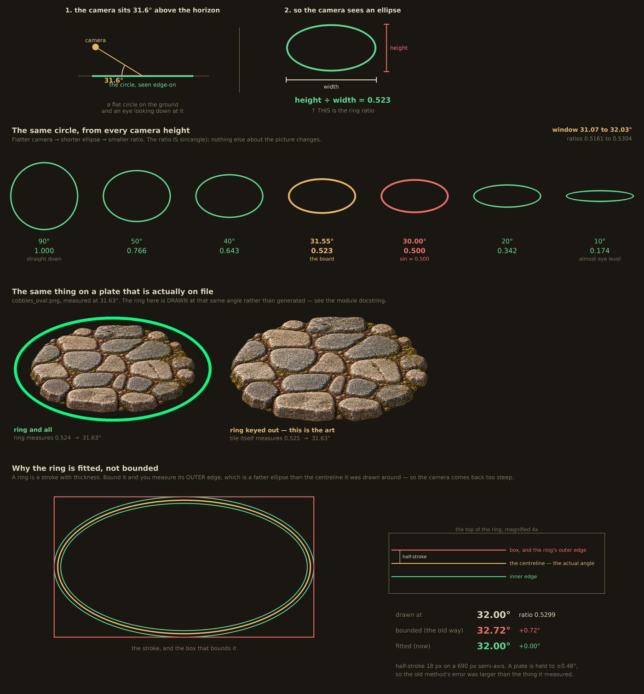

# The ring ratio: how a camera angle is measured

Redraw the picture with `python3 tools/ui_debug/generate_ring_ratio_explainer.py`. It reads
the constants and the art at run time rather than having numbers painted into it, so if the
set of plates moves, the picture moves with it.

## The one sentence

A circle lying flat on the ground, seen from an angle θ above the horizon, projects as an
ellipse whose height is `sin(θ)` times its width. That fraction — height divided by width —
is the **ring ratio**, and it is the only thing in this project that measures a camera.

Everything else follows. 0.500 is 30°, 0.523 is 31.55°, 0.530 is 32°, 1.000 is straight
down. Nothing about the subject changes the arithmetic: a figurine's plinth, a paved floor
and a drawn guide ring are all circles on the same ground, so all three give the same answer
when the camera is the same. That is the whole reason the number is worth having — it is
what lets a ground plate and a sculpt be compared at all, when the two were generated
separately, months apart, and have no other property in common.

## Why measure it

A duty tile is figures standing on a plate. If the plate was drawn from a camera 8° higher
than the figures were, the figures do not look like they are standing on it — they look
pasted onto it, and nobody can say why. The failure is real and hard to name by eye, which
is exactly the kind of thing worth turning into a number.

So both halves are measured the same way and held to a window. `TARGET_DEGREES` (32.0,
tolerance 2.5) governs sculpts; `GROUND_TARGET_DEGREES` (31.55, tolerance 0.48) governs
plates. Both live in `tools/ui_debug/generate_asset_check.py` and both are shown on the
asset-check page, where they are editable boxes rather than constants so a judgement can be
re-run against a different window without editing code.

The two numbers are four tenths of a degree apart. That gap is not slack — it is the
agreement, measured rather than asserted, and a test fails if it opens past a degree.

## Where the plate numbers come from

They are **read off the plates**, not chosen. Every plate on file has been looked at under
figures and kept, so the set is the specification: its mean is the target, and the furthest
any accepted member strays from that mean is the tolerance.

| plate | degrees | from the mean | |
|---|---|---|---|
| `slate_irregular` | 31.07 | −0.47 | |
| `planks_rough` | 31.14 | −0.40 | recorded from its ring; its outline reads 30.66 |
| `flagstones_grey` | 31.52 | −0.02 | |
| `cobbles_oval` | 31.63 | +0.09 | |
| `limestone_irregular` | 31.89 | +0.35 | |
| `flagstones_slab` | 32.02 | +0.48 | |

Mean 31.55, largest deviation 0.48, so the window is **31.07 to 32.03** — as ratios, 0.5161
to 0.5304.

This replaced a target of 32.0 with a tolerance of 1.0, and both of those had been picked
rather than measured: 32 was a round number the board had settled on, and 1.0 was half the
sculpt figure. The set never actually centred on 32 — five of the six sit below it.

The new window is half as wide, deliberately. Run it against the batch of five that produced
the current cobbles plate and it admits exactly the one that was chosen by eye: 31.6 passes,
and 32.2, 32.9, 34.4 and 35.9 do not. One usable plate in five is what this work has cost
all along, and a tolerance that admitted four of them was not describing what was being
accepted.

`test_the_plate_numbers_are_read_off_the_plates` recomputes the mean and the worst deviation
from the folder and fails if the constants have drifted from the art. File a plate outside
the window and it fails, which is the moment to decide whether the plate is wrong or the
family has moved.

**The rule is a ratchet, and that is worth knowing before leaning on it.** Accept a plate and
the window follows it, so each accepted outlier loosens the bar that judges the next one.
`planks_rough` was the first test of that. Filed at its outline's 30.66 it would have moved
the tolerance from 0.52 to 0.80 — a 54% wider window on the strength of one plate. Filed at
its ring's 31.14, which is the better of its two readings for the reason below, the window
actually *tightened*, 0.55 to 0.48. Filing a plate near the edge is cheap; filing one past it is how the specification
stops meaning anything.

### A plate may carry its own camera

Most do not, and should not. A round rimmed plate's outline **is** an ellipse, `ground_ellipse`
measures it directly, and nothing needs writing down.

A ragged patch is not an ellipse, and the fit is a best guess at a shape that has none. On
`planks_rough` it visibly misses — bulging past the timber on one side and falling inside it on
the other — and reads 30.66, where the measuring ring drawn on the source image, which really
is a circle, fits at 31.14. So `duty_grounds.json` carries that plate's camera under
`grounds.planks_rough.camera`, and the asset page reports it as the plate's angle.

The measured outline is still shown beside it and never replaced. A recorded number is exactly
the kind of thing that rots: the ring is stripped when the art is filed, so nothing in the
repository can re-derive it, which makes it the one figure here that no later measurement
contradicts. Two tests guard it. `test_a_recorded_camera_cannot_hide_a_bad_plate` refuses a
recorded camera further than 1.5° from the plate's own outline — the same bar a candidate's
ring and outline must agree within, and a plate failing it should never have been filed — and
refuses one that does not say where it came from. `planks_rough` is the first and so far only
plate with one.

## The measuring ring

Most ground plates are round with a rim, and a round plate's own outline is an ellipse you
can measure directly. A **ragged** plate is not: a patch of cobbles that simply stops in
packed earth has no ellipse to fit, and fitting one anyway returns a number that looks
plausible and means nothing.

So the briefs ask the generator to draw a guide: a single closed ellipse around the whole
tile, in flat spring green, representing a perfect circle lying on the same ground. It is a
jig, not artwork. `sculpt_metrics.py` measures it, then removes it, and what is filed is the
tile alone.

Four details of the implementation are not obvious and each cost a round to learn.

**Spring green, RGB 0 255 128, because it has to sit outside the palette.** Magenta was the
obvious choice and it is wrong: measured across all committed PNGs in `ui/assets-gothic/`,
magenta comes within 34 of `stones_plum.png`, plum being a purple. Spring green's closest
approach is 182, in `stones_sage.png`. A key that lives inside the palette eats the art.

**The ring is fitted, not bounded — and getting this wrong cost more than the whole
tolerance.** `ground_ellipse` looks for the widest row, so a hollow ellipse handed over
as-is measures 10° when it was drawn at 32. The first fix was to fill the hole and bound the
result, and that is subtly wrong: filling an annulus recovers its **outer** edge, and an
outer edge is a fatter ellipse than the centreline it was drawn around, because adding
half-stroke `t` to both semi-axes gives `(b+t)/(a+t)`, which exceeds `b/a` whenever `b < a`.
Every reading was therefore biased toward a steeper camera, by an amount that grows with the
stroke — and the briefs ask for a stroke of about 2% of the tile's width.

Measured against rings whose centreline is known exactly, the bounding method erred by +0.27
to +0.48° at a 9 px half-stroke and by **+0.70°** at 18 px. A plate is held to 0.48°, so the
instrument's bias was larger than the thing it was measuring. `ring_ellipse` now fits a conic
to the ring's pixels by least squares — plain numpy SVD, since OpenCV is not a dependency —
which is exact to 0.01° anywhere in the 28–34° band this board works in. It degrades to 0.22°
only at 40° with a fat stroke, where a constant-width band is least like an ellipse, and no
plate will ever sit there.

The fill is still used, for what it is actually good at: deciding whether the loop is closed.

**Why the suite did not catch it.** The fixture drew its ring with PIL's `ellipse` outline,
which strokes *inward* from the bounding box — so filling it recovered the box exactly and the
round trip was perfect. The fixture was not representative of the thing being measured. It now
draws the band between two ellipses, so the centreline is known, and
`test_the_ring_is_fitted_and_not_merely_bounded` asserts the old method fails on it, or the
fixture would not be exercising the bias at all.

**A broken ring refuses rather than reporting.** The ring's height is `2 × radius × sin(θ)`,
so at a shallow camera a ring that looks generous side to side is still shorter than the
tile it encircles, and the tile sits on top of it. At 1.04 times the tile's height a 32° ring
read 6.0; at 1.20 it read 31.9. The briefs ask for a clear gap all the way round for this
reason, and `ring_ellipse` returns `None` on an open loop rather than reporting the number
that occlusion produces.

**Removing the ring means removing its soft edge too.** A pixel halfway along the ring's
antialiased edge is a blend of green and transparent background: low alpha, and an RGB pulled
far enough off the key to survive a colour test. The first version of `without_ring` left
those behind, and what survived was a faint ghost of the ring exactly where the ring had
been. On the cobbles candidate of 2026-09-23 the ring was 1382 px wide and the stripped
image's `alpha>8` box was still 1382, while the solid plate was 1159. It never moved a
measured angle — `ground_ellipse` fits the shape rather than taking a bounding box, and the
ghost was 0.8% of the ink — but every preview that crops came out 16% too wide. The stripper
now dilates the keyed mask and drops whatever is not near-opaque inside that band.

## What can carry a camera, and what cannot

**A circle can.** Its plan shape is known, so its foreshortening is the only thing that can
have changed it.

**A rectangle cannot.** Its height-over-width confounds foreshortening with plan proportions
and there is no way to separate them from the picture alone. The timber reference at
`ui/assets-gothic/grounds/candidates/planks_rough_c01.png` is the worked example: its ink is
1181 × 855, h/w 0.724, which is 46.4° if that patch is square in plan, 32.9° if it is 3:4 and
74.9° if it is 4:3. Three answers from one image, and nothing in the image says which.
`ground_ellipse` returns 21.8° on it, which is meaningless — 14% of its rows are within 2% of
the widest, so it is not an ellipse at all.

This matters when writing a brief. A reference image is handed the camera by the first
sentence of most of our briefs, and handing it to something that has no camera to give is how
two cobbles batches went astray. `prompts/planks_rough.md` therefore attaches two images and
says which job each one has.

## What the ring ratio is *not*

It is **not the anchor**. The two are unrelated quantities that both happen to sit near 0.5
in this project, which makes them easy to confuse.

The ratio is a *shape* — how squashed the ellipse is — and it is decided entirely by the
camera. The anchor is a *position*: how far down a piece of art its widest row falls, which
is where figures' feet belong on that particular picture. It is 48% on the rimmed plates and
58% on `cobbles_oval`, and the difference is the rim, not the camera: a rim is most of what
sits below the equator, so a plate without one has less ink under its widest row.

Drawing the same disc at five cameras makes the independence plain:

| camera | ratio | anchor |
|---|---|---|
| 25° | 0.421 | 47.5% |
| 30° | 0.496 | 47.5% |
| 32° | 0.527 | 47.4% |
| 40° | 0.640 | 47.6% |
| 50° | 0.762 | 47.5% |

The ratio sweeps its whole useful range; the anchor does not move. It cannot: the widest row
of an ellipse is at its vertical midpoint whatever angle you view it from.

The practical consequence is that moving a brief's target changes the camera and does not
change where figures stand — and if figures need to stand differently on a plate, that is the
`anchor` in `duty_grounds.json`, and editing the brief would be the wrong lever entirely.

## Two ways this measurement has fooled us

Both are worth keeping because both looked like findings at the time.

**The jig measured itself.** The first ringed cobbles batch, 2026-09-23, produced five clean
closed rings all inside a one-degree window — and four of the five tiles inside them were at
a different angle from their own ring, by up to 6.6°. The ring was honest about its own
geometry and said nothing about the tile. The fix is a cross-check rather than a single
number: report both the ring and the tile's outline, and require them to agree. On the plate
that was filed they agree to 0.1°.

**The ring measures, it does not steer.** Across three batches the rings' own angles averaged
32.0, 29.0 and 32.6, with within-batch standard deviations of 0.49, 0.68 and 1.4 — tight
inside a batch, three degrees apart between them, on briefs asking for the same number. The
generator appears to choose a camera per session and hold it. So the ring tells you whether a
batch is usable; it does not make it so, and more than one batch should be expected.

**The instrument was biased and its own test said otherwise.** This is the third, and the
worst, because unlike the other two it was invisible: a synthetic ring round-tripped
perfectly, so the suite reported the measurement as exact while it was out by up to 0.7° on
real rings. It surfaced only when someone measured one of our images independently, got 31.15
where our tooling said 31.57, and said so. The lesson is not about ellipses — it is that a
fixture built the same way as the code under test will agree with it for the wrong reason.

## Where things live

| | |
|---|---|
| the measurement | `tools/ui_debug/sculpt_metrics.py` — `ground_ellipse`, `ring_ellipse`, `without_ring` |
| the window | `tools/ui_debug/generate_asset_check.py` — `GROUND_TARGET_DEGREES`, `GROUND_TOLERANCE_DEGREES` |
| the judgement | the ground-tiles tab of `tools/ui_debug/generated/asset_check.html` |
| the briefs that ask for a ring | `tools/ui_debug/prompts/*.md` |
| this picture | `tools/ui_debug/generate_ring_ratio_explainer.py` |
| the camera decision itself | [`duty_tile_art_plan.md`](duty_tile_art_plan.md) |
